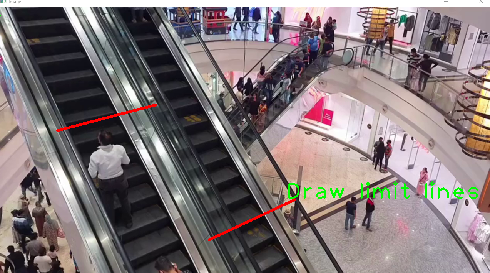

# Count person application YOLO
 Count the number of people in different direction apply OpenCV and YOLO

## Setup
- Install python3 and anaconda for openCV.  
- Setup virtual environment in anaconda
- To install necessary library  
`pip install -r requirements.txt`
## Run
- Replace your video file name in line 44 of main.py file with your video path.
- Run command on console
`python3 main.py`
## Use app
- First draw counter line in both direction up and down by left mouse.
- Press a to change from draw line to draw area
- To draw detection zone on image, use left mouse. 
- To drag the point, use left mouse to choose and drag to other location
- To delete a point, use right mouse, application will choose the nearest point to delete
- After finishing draw detection zone, press **b** to run streaming video.

